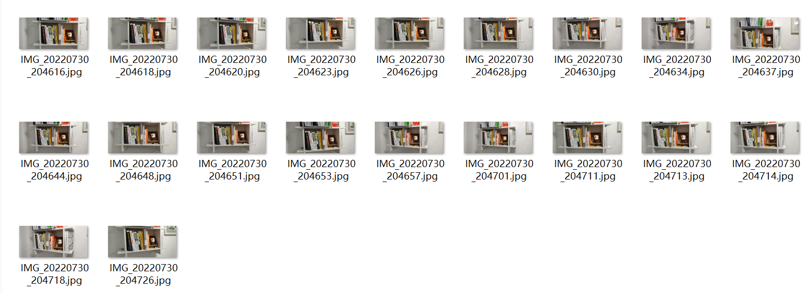
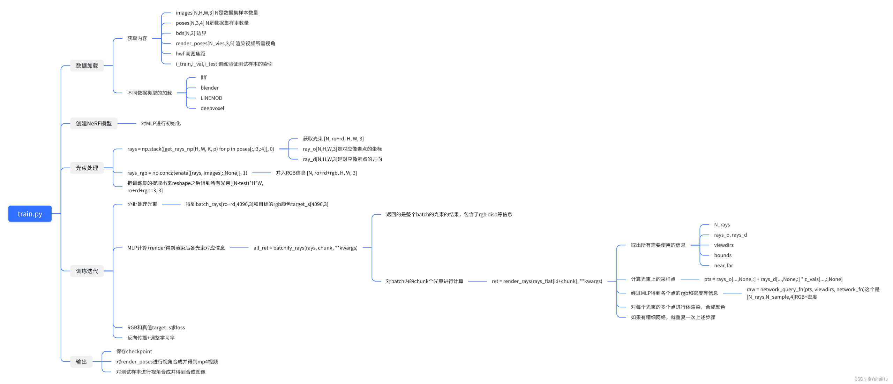
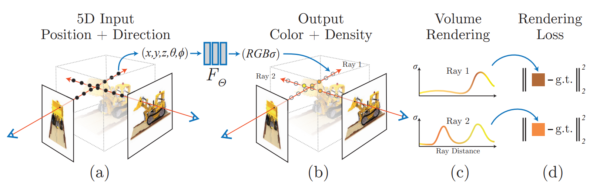
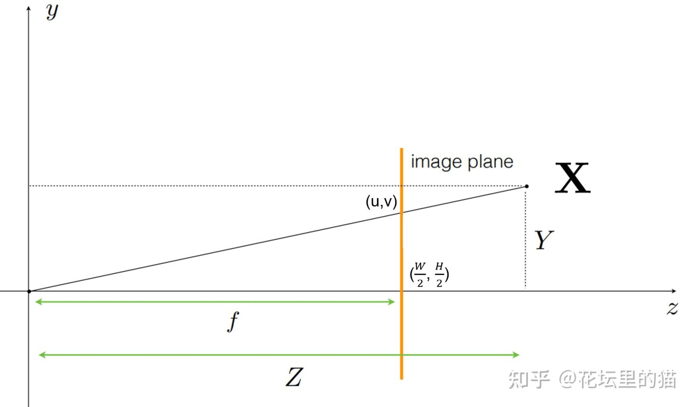
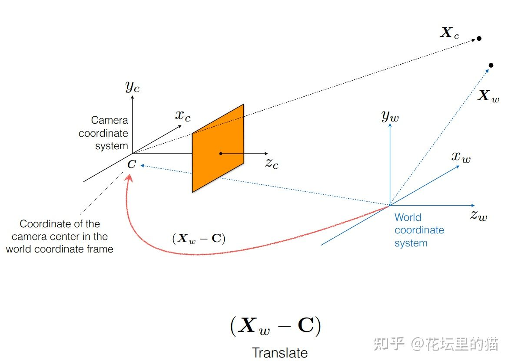
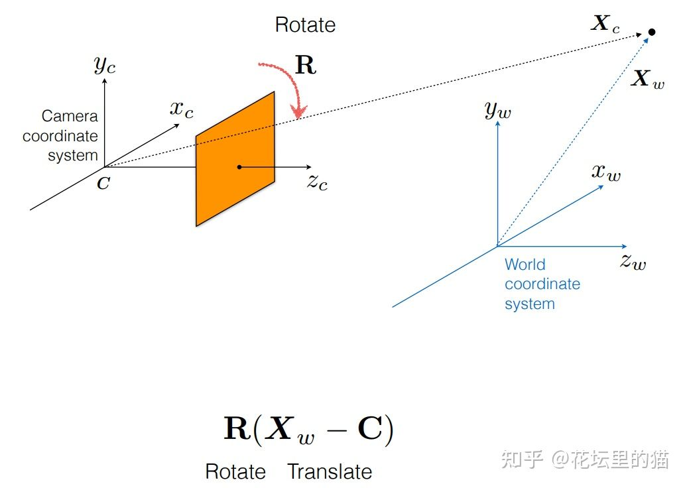

# Nerf-pytorch-try

代码链接：[nerf-pytorch](https://github.com/yenchenlin/nerf-pytorch)

运行nerf-pytorch训练自己的数据集

测试环境：

pytorch 1.11.0
- [Nerf-pytorch-try](#nerf-pytorch-try)
  - [运行流程](#运行流程)
    - [1 数据准备：](#1-数据准备)
      - [1.1 多视角2D图像准备](#11-多视角2d图像准备)
      - [1.2 相机内外参估计](#12-相机内外参估计)
    - [2 运行训练](#2-运行训练)
      - [2.1 填写配置文件](#21-填写配置文件)
      - [2.2 训练](#22-训练)
    - [3 得到结果](#3-得到结果)
  - [项目代码详解](#项目代码详解)
    - [文件结构](#文件结构)
    - [参数设置](#参数设置)
      - [`config_parser()`](#config_parser)
    - [训练过程](#训练过程)
      - [数据加载](#数据加载)
        - [`_minify()`](#_minify)
        - [`_load_data()`](#_load_data)
        - [`poses_avg()`](#poses_avg)
        - [`viewmatirx()`](#viewmatirx)
        - [`recenter_poses()`](#recenter_poses)
        - [`load_llff_data()`](#load_llff_data)
      - [`train()`](#train)
        - [`create_nerf()`](#create_nerf)
        - [`run_network()`](#run_network)
        - [`bathify()`](#bathify)
      - [位置编码相关](#位置编码相关)
        - [`get_embedder()`和Class `Embedder`](#get_embedder和class-embedder)
      - [模型结构](#模型结构)
        - [Class `Nerf`](#class-nerf)
      - [输入生成与坐标系变换](#输入生成与坐标系变换)
        - [`get_rays_np()`](#get_rays_np)
      - [体渲染](#体渲染)
        - [`render()`](#render)
        - [`ndc_rays()`](#ndc_rays)
        - [`batchify_rays()`](#batchify_rays)
        - [`render_rays()`](#render_rays)
        - [`raw2outputs()`](#raw2outputs)
  - [一些参考资料](#一些参考资料)
## 运行流程

### 1 数据准备：

#### 1.1 多视角2D图像准备

想要利用NeRF拟合自己拍摄的3D场景，首先需要准备多张从不同角度拍摄的同场景静态2D图像。

例如：



#### 1.2 相机内外参估计

针对*LLFF*格式给出的数据

不过仅仅有2D多视图还不够，在重建阶段，我们还需要各个点的位置 x={x,y,z} 和方位 d={θ,ϕ} 作为输入进行重建。为了获得这些数据，NeRF中采用了传统方法COLMAP进行参数估计。还是以沙发为例，通过COLMAP可以得到场景的稀疏重建结果，其输出文件包括相机内参，相机外参和3D点的信息，然后进一步利用LLFF开源代码中的[imgs2poses](https://link.zhihu.com/?target=https%3A//github.com/Fyusion/LLFF/blob/master/imgs2poses.py)文件将内外参整合到一个文件`poses_boudns.npy`中。

`poses_boudns.npy`记录了相机的内参,包括图片分辨率（图片高与宽度）、焦距，共3个维度、外参（包括相机坐标到世界坐标转换的平移矩阵 t 与旋转矩阵 R，其中旋转矩阵为 $R∈R^{3×3}$ 的矩阵，共9个维度，平移矩阵为 $t∈R^{3×1}$ 的矩阵，3个维度，因此该文件中的数据维度为 N×17 （另有两个维度为光线的始发深度与终止深度，通过COLMAP输出的3D点位置计算得到），其中N为图片样本数。

具体操作：

（1）使用colmap进行稀疏重建生成姿态

可以使用gui版本直接点，也可以使用LLFF的代码进行操作，这里我直接使用gui进行了操作（如果不知道如何操作可以上网搜索，默认操作就可），注意指定最后的文件夹格式如下，主要是注意是sparse/0下存放：

```
.
|-- images
|   |-- xxxx.jpg
|   `-- ...
|-- dirname.db
`-- sparse
    `-- 0
        |-- cameras.bin
        |-- images.bin
        |-- points3D.bin
        `-- project.ini
```

（2）使用LLFF项目里的代码进行存储姿态到npy文件里

自己小小修改了点`imgs2poses`相关的代码，改成默认的factor为8，会进行8倍缩放，可以根据需要自己修改数值

```python
if __name__=='__main__':
    gen_poses(args.scenedir, args.match_type,factors=8)
```

根据提示，运行`python imgs2mpis.py <your_scenedir>`，scendir为你刚刚图片images所在的目录名，最后就会生成缩放的图片（如果有)以及poses_bounds.npy文件。

如果是factors=8的话，最后的文件夹就如下所示

```
.
|-- images
|   |-- xxx.jpg
|   `-- ...
|-- images_8
|   |-- image000.png
|   `-- ...
|-- dirname.db
|-- poses_bounds.npy
`-- sparse
    `-- 0
        |-- cameras.bin
        |-- images.bin
        |-- points3D.bin
        `-- project.ini
```

### 2 运行训练

#### 2.1 填写配置文件

可以仿照fern项目写一个txt配置放在config文件夹里，这里我直接什么参数没改，直接抄了：

home.txt

```
expname = home_test
basedir = ./logs
datadir = ./data/home
dataset_type = llff

factor = 8
llffhold = 8

N_rand = 1024
N_samples = 64
N_importance = 64

use_viewdirs = True
raw_noise_std = 1e0
```

注意填对datadir和数据集的类型，这里使用的llff数据。

#### 2.2 训练

按照原来repo的提示：

```
python run_nerf.py --config configs/{DATASET}.txt
```

replace `{DATASET}` with `trex` | `horns` | `flower` | `fortress` | `lego` | etc.

如果你训练的是360度的场景，那么你可以加上`--spherify`以及`--no_ndc`,即：

```
python run_nerf.py --config configs/{DATASET}.txt --no_ndc --spherify
```

### 3 得到结果

训练结束你就可以在logs下相应的名称的文件夹下看到你的结果，包括测试的图片，模型参数和video。


## 项目代码详解

图片来自[1]



### 文件结构

`config`文件夹下存放运行时的config的txt文件

`data`文件夹下存放的是数据

`logs`文件夹下存放的是运行的结果和保存的模型参数

有关于加载几个类型存放格式的数据的函数：

- `load_llff.py`
- `load_blender.py`
- `load_deepvoxels.py`
- `load_LINEMOD.py`

主要的函数（包括训练、测试等）：

`run_nerf.py`

nerf相关的一些其他的函数

`load_nerf_helper.py`

### 参数设置

对于这一个项目，只有一个train函数进行运行，所有的测试切换都对应于train的参数输入来设置

#### `config_parser()`

`run_nerf.py`->`config_parser()`

``` python
def config_parser():

    import configargparse
    parser = configargparse.ArgumentParser()
    # 运行所配置的config.txt文件的路径
    parser.add_argument('--config', is_config_file=True,
                        help='config file path')
    # 指定实验名称
    parser.add_argument("--expname", type=str,
                        help='experiment name')
    # 指定输出目录
    parser.add_argument("--basedir", type=str, default='./logs/',
                        help='where to store ckpts and logs')
    # 指定输入数据目录
    parser.add_argument("--datadir", type=str, default='./data/llff/fern',
                        help='input data directory')

    # training options
    # 设置网络的深度，即网络的层数
    parser.add_argument("--netdepth", type=int, default=8,
                        help='layers in network')

    # 设置网络的宽度，即每一层神经元的个数
    parser.add_argument("--netwidth", type=int, default=256,
                        help='channels per layer')

    # 精细网络的设置，含义同上粗网络
    parser.add_argument("--netdepth_fine", type=int, default=8,
                        help='layers in fine network')
    parser.add_argument("--netwidth_fine", type=int, default=256,
                        help='channels per layer in fine network')

    # batch size，光束的数量
    parser.add_argument("--N_rand", type=int, default=32 * 32 * 4,
                        help='batch size (number of random rays per gradient step)')

    # 学习率
    parser.add_argument("--lrate", type=float, default=5e-4,
                        help='learning rate')

    # 指数学习率衰减
    parser.add_argument("--lrate_decay", type=int, default=250,
                        help='exponential learning rate decay (in 1000 steps)')

    # 并行处理的光线数量，如果溢出则减少
    parser.add_argument("--chunk", type=int, default=1024 * 32,
                        help='number of rays processed in parallel, decrease if running out of memory')

    # 并行发送的点数
    parser.add_argument("--netchunk", type=int, default=1024 * 64,
                        help='number of pts sent through network in parallel, decrease if running out of memory')

    # 一次只能从一张图片中获取随机光线
    parser.add_argument("--no_batching", action='store_true',
                        help='only take random rays from 1 image at a time')

    # 不要从保存的模型中加载权重
    parser.add_argument("--no_reload", action='store_true',
                        help='do not reload weights from saved ckpt')

    # 为粗网络重新加载特定权重
    parser.add_argument("--ft_path", type=str, default=None,
                        help='specific weights npy file to reload for coarse network')

    # rendering options
    # 每条射线的粗样本数
    parser.add_argument("--N_samples", type=int, default=64,
                        help='number of coarse samples per ray')

    # 每条射线附加的细样本数
    parser.add_argument("--N_importance", type=int, default=0,
                        help='number of additional fine samples per ray')

    parser.add_argument("--perturb", type=float, default=1.,
                        help='set to 0. for no jitter, 1. for jitter')

    # 使用5D输入
    parser.add_argument("--use_viewdirs", action='store_true',
                        help='use full 5D input instead of 3D')

    # 默认使用位置编码
    parser.add_argument("--i_embed", type=int, default=0,
                        help='set 0 for default positional encoding, -1 for none')

    # 3D位置的位置编码的frequency设置
    parser.add_argument("--multires", type=int, default=10,
                        help='log2 of max freq for positional encoding (3D location)')

    # 2D方向的位置编码的frequency设置
    parser.add_argument("--multires_views", type=int, default=4,
                        help='log2 of max freq for positional encoding (2D direction)')

    # 噪音方差
    parser.add_argument("--raw_noise_std", type=float, default=0.,
                        help='std dev of noise added to regularize sigma_a output, 1e0 recommended')

    # 只是渲染结果，不要优化，重新加载权重和渲染render_poses路径下的视角
    parser.add_argument("--render_only", action='store_true',
                        help='do not optimize, reload weights and render out render_poses path')

    # 渲染测试集而不是render_poses path的新视角
    parser.add_argument("--render_test", action='store_true',
                        help='render the test set instead of render_poses path')

    # 下采样因子以加快渲染速度，设置为 4 或 8 用于快速预览
    parser.add_argument("--render_factor", type=int, default=0,
                        help='downsampling factor to speed up rendering, set 4 or 8 for fast preview')

    # training options
    parser.add_argument("--precrop_iters", type=int, default=0,
                        help='number of steps to train on central crops')
    parser.add_argument("--precrop_frac", type=float,
                        default=.5, help='fraction of img taken for central crops')

    # dataset options
    parser.add_argument("--dataset_type", type=str, default='llff',
                        help='options: llff / blender / deepvoxels')

    # 将从测试/验证集中加载 1/N 图像，这对于像 deepvoxels 这样的大型数据集很有用
    parser.add_argument("--testskip", type=int, default=8,
                        help='will load 1/N images from test/val sets, useful for large datasets like deepvoxels')

    ## deepvoxels flags
    parser.add_argument("--shape", type=str, default='greek',
                        help='options : armchair / cube / greek / vase')

    ## blender flags
    parser.add_argument("--white_bkgd", action='store_true',
                        help='set to render synthetic data on a white bkgd (always use for dvoxels)')
    parser.add_argument("--half_res", action='store_true',
                        help='load blender synthetic data at 400x400 instead of 800x800')

    ## llff flags
    # LLFF下采样因子
    parser.add_argument("--factor", type=int, default=8,
                        help='downsample factor for LLFF images')
    parser.add_argument("--no_ndc", action='store_true',
                        help='do not use normalized device coordinates (set for non-forward facing scenes)')
    parser.add_argument("--lindisp", action='store_true',
                        help='sampling linearly in disparity rather than depth')
    parser.add_argument("--spherify", action='store_true',
                        help='set for spherical 360 scenes')
    parser.add_argument("--llffhold", type=int, default=8,
                        help='will take every 1/N images as LLFF test set, paper uses 8')

    # logging/saving options
    parser.add_argument("--i_print", type=int, default=100,
                        help='frequency of console printout and metric loggin')
    parser.add_argument("--i_img", type=int, default=500,
                        help='frequency of tensorboard image logging')
    parser.add_argument("--i_weights", type=int, default=10000,
                        help='frequency of weight ckpt saving')
    parser.add_argument("--i_testset", type=int, default=50000,
                        help='frequency of testset saving')
    parser.add_argument("--i_video", type=int, default=50000,
                        help='frequency of render_poses video saving')

    return parser
```

### 训练过程

训练过程的控制。开始训练，先把5D输入进行编码，然后交给MLP得到4D的数据（颜色和体素的密度），然后进行体渲染得到图片，再和真值计算L2 loss。




#### 数据加载

##### `_minify()`

所在文件：`load_llff.py`

这个函数主要负责创建目标分辨率的数据集,不过我们前面用的LLFF仓库里的代码做的缩放，这里其实没有进行实际操作，一开始判断存在文件夹就返回了。

这里应该是运用linux环境下的某个命令直接resize图片

```python
def _minify(basedir, factors=[], resolutions=[]):
    needtoload = False
    for r in factors:
        imgdir = os.path.join(basedir, 'images_{}'.format(r))
        if not os.path.exists(imgdir):
            needtoload = True
    for r in resolutions:
        imgdir = os.path.join(basedir, 'images_{}x{}'.format(r[1], r[0]))
        if not os.path.exists(imgdir):
            needtoload = True
    if not needtoload:
        return
    
    from shutil import copy
    from subprocess import check_output
    
    imgdir = os.path.join(basedir, 'images')
    imgs = [os.path.join(imgdir, f) for f in sorted(os.listdir(imgdir))]
    imgs = [f for f in imgs if any([f.endswith(ex) for ex in ['JPG', 'jpg', 'png', 'jpeg', 'PNG']])]
    imgdir_orig = imgdir
    
    wd = os.getcwd()

    for r in factors + resolutions:
        if isinstance(r, int):
            name = 'images_{}'.format(r)
            resizearg = '{}%'.format(100./r)
        else:
            name = 'images_{}x{}'.format(r[1], r[0])
            resizearg = '{}x{}'.format(r[1], r[0])
        imgdir = os.path.join(basedir, name)
        if os.path.exists(imgdir):
            continue
            
        print('Minifying', r, basedir)
        
        os.makedirs(imgdir)
        check_output('cp {}/* {}'.format(imgdir_orig, imgdir), shell=True)
        
        ext = imgs[0].split('.')[-1]
        args = ' '.join(['mogrify', '-resize', resizearg, '-format', 'png', '*.{}'.format(ext)])
        print(args)
        os.chdir(imgdir)
        check_output(args, shell=True)
        os.chdir(wd)
        
        if ext != 'png':
            check_output('rm {}/*.{}'.format(imgdir, ext), shell=True)
            print('Removed duplicates')
        print('Done')
```

##### `_load_data()`

所在文件：`load_llff.py`

读取npy文件和图片文件夹，返回数据

```python
def _load_data(basedir, factor=None, width=None, height=None, load_imgs=True):
    # 读取npy文件
    poses_arr = np.load(os.path.join(basedir, 'poses_bounds.npy')) # [N, 17]
    poses = poses_arr[:, :-2].reshape([-1, 3, 5]).transpose([1,2,0]) # [3, 5, N]
    bds = poses_arr[:, -2:].transpose([1,0]) # [2, N]

    # 单张图片
    img0 = [os.path.join(basedir, 'images', f) for f in sorted(os.listdir(os.path.join(basedir, 'images'))) \
            if f.endswith('JPG') or f.endswith('jpg') or f.endswith('png')][0]
    # 获取单张图片的shape
    sh = imageio.imread(img0).shape
    
    sfx = ''
    
    if factor is not None:
        sfx = '_{}'.format(factor)
        _minify(basedir, factors=[factor])
        factor = factor
    elif height is not None:
        factor = sh[0] / float(height)
        width = int(sh[1] / factor)
        _minify(basedir, resolutions=[[height, width]])
        sfx = '_{}x{}'.format(width, height)
    elif width is not None:
        factor = sh[1] / float(width)
        height = int(sh[0] / factor)
        _minify(basedir, resolutions=[[height, width]])
        sfx = '_{}x{}'.format(width, height)
    else:
        factor = 1
    
    imgdir = os.path.join(basedir, 'images' + sfx)
    if not os.path.exists(imgdir):
        print( imgdir, 'does not exist, returning' )
        return

    # 包含了目标数据的路径
    imgfiles = [os.path.join(imgdir, f) for f in sorted(os.listdir(imgdir)) if f.endswith('JPG') or f.endswith('jpg') or f.endswith('png')]
    if poses.shape[-1] != len(imgfiles):
        print( 'Mismatch between imgs {} and poses {} !!!!'.format(len(imgfiles), poses.shape[-1]) )
        return
    
    sh = imageio.imread(imgfiles[0]).shape
    # 因为图片进行了缩放，需要对相机内参也进行变换
    poses[:2, 4, :] = np.array(sh[:2]).reshape([2, 1])  # 把 h w更新为缩放后的尺寸
    poses[2, 4, :] = poses[2, 4, :] * 1./factor   # 把 f 也进行缩放
    
    if not load_imgs:
        return poses, bds
    
    def imread(f):
        if f.endswith('png'):
            return imageio.imread(f, ignoregamma=True)
        else:
            return imageio.imread(f)

    # 读取所有图像数据并把值缩小到0-1之间
    imgs = imgs = [imread(f)[...,:3]/255. for f in imgfiles]
    imgs = np.stack(imgs, -1)  
    
    print('Loaded image data', imgs.shape, poses[:,-1,0])
    return poses, bds, imgs
```

##### `poses_avg()`

所在文件：`load_llff.py`

计算所有照片相机姿态的一个平均的pose

>   Calculate the average pose, which is then used to center all poses
>     using @center_poses. Its computation is as follows:
>
>     1. Compute the center: the average of pose centers.
>     2. Compute the z axis: the normalized average z axis.
>     3. Compute axis y': the average y axis.
>     4. Compute x' = y' cross product z, then normalize it as the x axis.
>     5. Compute the y axis: z cross product x.
>
> ​    Note that at step 3, we cannot directly use y' as y axis since it's
> ​    not necessarily orthogonal to z axis. We need to pass from x to y.

```python
def poses_avg(poses):
    # 计算 a "central" pose for the dataset based on using the mean translation, the mean z axis
    hwf = poses[0, :3, -1:]  # 取出最后一列即为hwf

    center = poses[:, :3, 3].mean(0)  # 平移的量即为在世界坐标中的相机坐标，求所有相机的中心 [3,1]
    vec2 = normalize(poses[:, :3, 2].sum(0))  # mean z [3,1]
    # adopting the mean y axis as an "up" direction
    up = poses[:, :3, 1].sum(0) # [3,1]
    # 所以就可以Up x Z = X and then Z x X = Y
    c2w = np.concatenate([viewmatrix(vec2, up, center), hwf], 1)
```

##### `viewmatirx()`

所在文件：`load_llff.py`

给定z方向，和up方向，以及原点的位置，然后来计算出一个pose，通过叉乘计算出三个坐标轴方向

```python
def viewmatrix(z, up, pos):
    vec2 = normalize(z)  # Z
    vec1_avg = up
    vec0 = normalize(np.cross(vec1_avg, vec2))  # Up x Z = X
    vec1 = normalize(np.cross(vec2, vec0))      # Z x X = Y
    m = np.stack([vec0, vec1, vec2, pos], 1)
    return m
```

##### `recenter_poses()`

所在文件：`load_llff.py`

>   Center the poses so that we can use NDC.
>
>   See https://github.com/bmild/nerf/issues/34

```python
def recenter_poses(poses):

    poses_ = poses+0  # 拷贝一份 [20,3,5]
    bottom = np.reshape([0,0,0,1.], [1,4])
    c2w = poses_avg(poses) # 计算一个中心pose [3, 5]
    c2w = np.concatenate([c2w[:3,:4], bottom], -2) # [4, 4] 给最后一行添加 0 0 0 1
    bottom = np.tile(np.reshape(bottom, [1,1,4]), [poses.shape[0],1,1]) # [20, 1 ,4]
    poses = np.concatenate([poses[:,:3,:4], bottom], -2) # [20, 4, 4]

    poses = np.linalg.inv(c2w) @ poses  # 应该是把世界坐标系移到所有相机的照的中心位置
    poses_[:,:3,:4] = poses[:,:3,:4]
    poses = poses_
    return poses
```

##### `load_llff_data()`

所在文件：`load_llff.py`

```python
def load_llff_data(basedir, factor=8, recenter=True, bd_factor=.75, spherify=False, path_zflat=False):
    

    poses, bds, imgs = _load_data(basedir, factor=factor) # factor=8 downsamples original imgs by 8x
    print('Loaded', basedir, bds.min(), bds.max())
    
    # Correct rotation matrix ordering and move variable dim to axis 0
    # poses 从llff读取的 [down right back] 到 [right up back](opengl的右手系)
    poses = np.concatenate([poses[:, 1:2, :], -poses[:, 0:1, :], poses[:, 2:, :]], 1)
    poses = np.moveaxis(poses, -1, 0).astype(np.float32)
    imgs = np.moveaxis(imgs, -1, 0).astype(np.float32)
    images = imgs
    bds = np.moveaxis(bds, -1, 0).astype(np.float32)
    # 结束以后 poses [20,3,5] bds [20,2]

    # Rescale if bd_factor is provided
    # sc是进行边界缩放的比例
    # 这里缩放是为了满足后面使得near平面处有near稍微大于1(还不太明白)
    # correct scale so that the nearest depth is at a little more than 1.0
    # See https://github.com/bmild/nerf/issues/34
    sc = 1. if bd_factor is None else 1./(bds.min() * bd_factor)
    poses[:,:3,3] *= sc  # 平移变换那一列
    bds *= sc
    
    if recenter:
        # 修改pose（shape=图像数,通道数,5）前四列的值，只有最后一列（高、宽、焦距）不变
        poses = recenter_poses(poses)
        
    if spherify:
        poses, render_poses, bds = spherify_poses(poses, bds)

    else:

        # shape=(3,5)相当于汇集了所有图像
        c2w = poses_avg(poses)
        print('recentered', c2w.shape)
        print(c2w[:3,:4])

        ## Get spiral
        # Get average pose
        up = normalize(poses[:, :3, 1].sum(0))

        # Find a reasonable "focus depth" for this dataset
        close_depth, inf_depth = bds.min()*.9, bds.max()*5.
        dt = .75
        mean_dz = 1./(((1.-dt)/close_depth + dt/inf_depth))
        focal = mean_dz

        # Get radii for spiral path
        shrink_factor = .8
        zdelta = close_depth * .2
        # 获取所有poses的3列，shape(图片数,3)
        tt = poses[:,:3,3] # ptstocam(poses[:3,3,:].T, c2w).T
        # 求90百分位的值
        rads = np.percentile(np.abs(tt), 90, 0)
        c2w_path = c2w
        N_views = 120
        N_rots = 2
        if path_zflat:
            # zloc = np.percentile(tt, 10, 0)[2]
            zloc = -close_depth * .1
            c2w_path[:3,3] = c2w_path[:3,3] + zloc * c2w_path[:3,2]
            rads[2] = 0.
            N_rots = 1
            N_views/=2

        # Generate poses for spiral path
        # 一个list，有120（由N_views决定）个元素，每个元素shape(3,5)
        render_poses = render_path_spiral(c2w_path, up, rads, focal, zdelta, zrate=.5, rots=N_rots, N=N_views)
        
        
    render_poses = np.array(render_poses).astype(np.float32)

    c2w = poses_avg(poses)
    print('Data:')
    print(poses.shape, images.shape, bds.shape)
    
    dists = np.sum(np.square(c2w[:3,3] - poses[:,:3,3]), -1)
    i_test = np.argmin(dists)
    print('HOLDOUT view is', i_test)
    
    images = images.astype(np.float32)
    poses = poses.astype(np.float32)

    # images (图片数,高,宽,3通道), poses (图片数,3通道,5) ,bds (图片数,2) render_poses(N_views,图片数,5)，i_test为一个索引数字
    return images, poses, bds, render_poses, i_test
```

#### `train()`

`run_nerf.py`->`train()`

```python
def train():

    parser = config_parser()
    args = parser.parse_args()

    # Load data
    K = None
    if args.dataset_type == 'llff':
        # 以示例的fern数据测试 20张图片，8倍缩小后的分辨率 378 * 504
        # images: shape [20,378,504,3] raw图像
        # poses： shape [20,3,5] 每张图片的相机的姿态
        # render_poses：shape [120,3,5]  最后渲染的新视角，这里默认的参数生成的就是120张图片，然后合成一个mp4视频
        images, poses, bds, render_poses, i_test = load_llff_data(args.datadir, args.factor,
                                                                  recenter=True, bd_factor=.75,
                                                                  spherify=args.spherify)
        # hwf=[378,504,focal = 407.5658] poses每个batch的每一行最后一个元素拿出来,即pose[0]的最后一列
        hwf = poses[0, :3, -1]
        # shape: poses [20,3,4] hwf给出去之后把每一行的第5个元素删掉
        poses = poses[:, :3, :4]
        print('Loaded llff', images.shape, render_poses.shape, hwf, args.datadir)
        if not isinstance(i_test, list):
            i_test = [i_test]

        if args.llffhold > 0:
            print('Auto LLFF holdout,', args.llffhold)
            i_test = np.arange(images.shape[0])[::args.llffhold]

        # 验证集和测试集相同
        i_val = i_test
        # 剩下的部分当作训练集
        i_train = np.array([i for i in np.arange(int(images.shape[0])) if
                            (i not in i_test and i not in i_val)])

        print('DEFINING BOUNDS')
        # 定义边界值
        if args.no_ndc:
            near = np.ndarray.min(bds) * .9
            far = np.ndarray.max(bds) * 1.

        else:
            # 没说就是0-1的ndc坐标系
            near = 0.
            far = 1.
        print('NEAR FAR', near, far)

    elif args.dataset_type == 'blender':
        images, poses, render_poses, hwf, i_split = load_blender_data(args.datadir, args.half_res, args.testskip)
        print('Loaded blender', images.shape, render_poses.shape, hwf, args.datadir)
        i_train, i_val, i_test = i_split

        near = 2.
        far = 6.

        if args.white_bkgd:
            # Color = Color * alpha + Background * (1 - alpha)
            images = images[..., :3] * images[..., -1:] + (1. - images[..., -1:])
        else:
            images = images[..., :3]

    elif args.dataset_type == 'LINEMOD':
        images, poses, render_poses, hwf, K, i_split, near, far = load_LINEMOD_data(args.datadir, args.half_res, args.testskip)
        print(f'Loaded LINEMOD, images shape: {images.shape}, hwf: {hwf}, K: {K}')
        print(f'[CHECK HERE] near: {near}, far: {far}.')
        i_train, i_val, i_test = i_split

        if args.white_bkgd:
            images = images[..., :3] * images[..., -1:] + (1. - images[..., -1:])
        else:
            images = images[..., :3]

    elif args.dataset_type == 'deepvoxels':

        images, poses, render_poses, hwf, i_split = load_dv_data(scene=args.shape,
                                                                 basedir=args.datadir,
                                                                 testskip=args.testskip)

        print('Loaded deepvoxels', images.shape, render_poses.shape, hwf, args.datadir)
        i_train, i_val, i_test = i_split

        hemi_R = np.mean(np.linalg.norm(poses[:, :3, -1], axis=-1))
        near = hemi_R - 1.
        far = hemi_R + 1.

    else:
        print('Unknown dataset type', args.dataset_type, 'exiting')
        return

    # Cast intrinsics to right types
    H, W, focal = hwf
    H, W = int(H), int(W)
    hwf = [H, W, focal]

    if K is None:
        # 如果没有给定相机内参
        K = np.array([
            [focal, 0, 0.5 * W],
            [0, focal, 0.5 * H],
            [0, 0, 1]
        ])

    if args.render_test:
        render_poses = np.array(poses[i_test])

    # Create log dir and copy the config file
    basedir = args.basedir
    expname = args.expname
    os.makedirs(os.path.join(basedir, expname), exist_ok=True)
    f = os.path.join(basedir, expname, 'args.txt')
    with open(f, 'w') as file:
        for arg in sorted(vars(args)):
            attr = getattr(args, arg)
            file.write('{} = {}\n'.format(arg, attr))
    if args.config is not None:
        f = os.path.join(basedir, expname, 'config.txt')
        with open(f, 'w') as file:
            file.write(open(args.config, 'r').read())

    # Create nerf model
    render_kwargs_train, render_kwargs_test, start, grad_vars, optimizer = create_nerf(args)
    global_step = start

    bds_dict = {
        'near': near,
        'far': far,
    }
    # 本来都是dict类型，都有9个元素，加了bds之后就是11个元素了
    render_kwargs_train.update(bds_dict)
    render_kwargs_test.update(bds_dict)

    # Move testing data to GPU
    render_poses = torch.Tensor(render_poses).to(device)

    # Short circuit if only rendering out from trained model
    if args.render_only:
        print('RENDER ONLY')
        with torch.no_grad():
            if args.render_test:
                # render_test switches to test poses
                images = images[i_test]
            else:
                # Default is smoother render_poses path
                images = None

            testsavedir = os.path.join(basedir, expname, 'renderonly_{}_{:06d}'.format('test' if args.render_test else 'path', start))
            os.makedirs(testsavedir, exist_ok=True)
            print('test poses shape', render_poses.shape)

            rgbs, _ = render_path(render_poses, hwf, K, args.chunk, render_kwargs_test, gt_imgs=images, savedir=testsavedir, render_factor=args.render_factor)
            print('Done rendering', testsavedir)
            imageio.mimwrite(os.path.join(testsavedir, 'video.mp4'), to8b(rgbs), fps=30, quality=8)

            return

    # Prepare raybatch tensor if batching random rays
    N_rand = args.N_rand
    use_batching = not args.no_batching
    if use_batching:
        # For random ray batching
        print('get rays')
        rays = np.stack([get_rays_np(H, W, K, p) for p in poses[:, :3, :4]], 0)  # [N, ro+rd, H, W, 3]
        print('done, concats')
        # 沿axis=1拼接
        rays_rgb = np.concatenate([rays, images[:, None]], 1)  # [N, ro+rd+rgb, H, W, 3]
        # 改变shape
        rays_rgb = np.transpose(rays_rgb, [0, 2, 3, 1, 4])  # [N, H, W, ro+rd+rgb, 3]
        # rays_rgb shape:[N-测试样本数目=20-3=17,378,504,3,3]
        rays_rgb = np.stack([rays_rgb[i] for i in i_train], 0)  # train images only
        # 得到了(N-测试样本数目)*H*W个光束,rays_rgb shape:[(N-test)*H*W,3,3]
        rays_rgb = np.reshape(rays_rgb, [-1, 3, 3])  # [(N-1)*H*W, ro+rd+rgb, 3]
        rays_rgb = rays_rgb.astype(np.float32)
        print('shuffle rays')
        np.random.shuffle(rays_rgb)

        print('done')
        i_batch = 0

    # Move training data to GPU
    if use_batching:
        images = torch.Tensor(images).to(device)
    poses = torch.Tensor(poses).to(device)
    if use_batching:
        rays_rgb = torch.Tensor(rays_rgb).to(device)


    N_iters = 200000 + 1
    print('Begin')
    print('TRAIN views are', i_train)
    print('TEST views are', i_test)
    print('VAL views are', i_val)

    # Summary writers
    # writer = SummaryWriter(os.path.join(basedir, 'summaries', expname))

    start = start + 1
    for i in trange(start, N_iters):
        time0 = time.time()

        # Sample random ray batch
        if use_batching:
            # Random over all images
            batch = rays_rgb[i_batch:i_batch + N_rand]  # [B, 2+1, 3*?]
            # 转换0维和1维的位置[ro+rd+rgb,1024,3]
            batch = torch.transpose(batch, 0, 1)
            # shape: batch_rays shape[ro+rd,1024,3] target_s[1024,3]对应的是rgb
            batch_rays, target_s = batch[:2], batch[2]

            i_batch += N_rand
            # 如果所有样本都遍历过了则打乱数据
            if i_batch >= rays_rgb.shape[0]:
                print("Shuffle data after an epoch!")
                rand_idx = torch.randperm(rays_rgb.shape[0])
                rays_rgb = rays_rgb[rand_idx]
                i_batch = 0

        else:
            # Random from one image
            img_i = np.random.choice(i_train)
            target = images[img_i]
            target = torch.Tensor(target).to(device)
            pose = poses[img_i, :3, :4]

            if N_rand is not None:
                rays_o, rays_d = get_rays(H, W, K, torch.Tensor(pose))  # (H, W, 3), (H, W, 3)

                if i < args.precrop_iters:
                    dH = int(H // 2 * args.precrop_frac)
                    dW = int(W // 2 * args.precrop_frac)
                    coords = torch.stack(
                        torch.meshgrid(
                            torch.linspace(H // 2 - dH, H // 2 + dH - 1, 2 * dH),
                            torch.linspace(W // 2 - dW, W // 2 + dW - 1, 2 * dW)
                        ), -1)
                    if i == start:
                        print(f"[Config] Center cropping of size {2 * dH} x {2 * dW} is enabled until iter {args.precrop_iters}")
                else:
                    coords = torch.stack(torch.meshgrid(torch.linspace(0, H - 1, H), torch.linspace(0, W - 1, W)), -1)  # (H, W, 2)

                coords = torch.reshape(coords, [-1, 2])  # (H * W, 2)
                select_inds = np.random.choice(coords.shape[0], size=[N_rand], replace=False)  # (N_rand,)
                select_coords = coords[select_inds].long()  # (N_rand, 2)
                rays_o = rays_o[select_coords[:, 0], select_coords[:, 1]]  # (N_rand, 3)
                rays_d = rays_d[select_coords[:, 0], select_coords[:, 1]]  # (N_rand, 3)
                batch_rays = torch.stack([rays_o, rays_d], 0)
                target_s = target[select_coords[:, 0], select_coords[:, 1]]  # (N_rand, 3)

        #####  Core optimization loop  #####
        # chunk=32768, batch_rays[2,1024,3]
        # 返回渲染出的一个batch的rgb，disp（视差图），acc（不透明度）和extras（其他信息）
        # rgb  shape [1024, 3]刚好可以和target_s 对应上
        # disp shape (1024,)，对应4096个光束
        # acc  shape (1024,)， 对应4096个光束
        # extras 是一个dict，含有5个元素
        #       - raw   shape:[1024,128,4]
        #       - rgb0  shape:[1024,3]
        #       - disp0 shape:(1024,)
        #       - acc0  shape:(1024,)
        #       - z_std shape:(1024,)
        rgb, disp, acc, extras = render(H, W, K, chunk=args.chunk, rays=batch_rays,
                                        verbose=i < 10, retraw=True,
                                        **render_kwargs_train)

        optimizer.zero_grad()
        img_loss = img2mse(rgb, target_s)
        trans = extras['raw'][..., -1]
        loss = img_loss
        # 计算PSNR shape:[1]
        psnr = mse2psnr(img_loss)

        # 在extra里面的一个元素，求损失并加到整体损失上
        if 'rgb0' in extras:
            img_loss0 = img2mse(extras['rgb0'], target_s)
            loss = loss + img_loss0
            psnr0 = mse2psnr(img_loss0)

        loss.backward()
        optimizer.step()

        # NOTE: IMPORTANT!
        ###   update learning rate   ###
        decay_rate = 0.1
        decay_steps = args.lrate_decay * 1000
        new_lrate = args.lrate * (decay_rate ** (global_step / decay_steps))
        for param_group in optimizer.param_groups:
            param_group['lr'] = new_lrate
        ################################

        dt = time.time() - time0
        # print(f"Step: {global_step}, Loss: {loss}, Time: {dt}")
        #####           end            #####

        # Rest is logging
        if i % args.i_weights == 0:
            path = os.path.join(basedir, expname, '{:06d}.tar'.format(i))
            torch.save({
                'global_step': global_step,
                'network_fn_state_dict': render_kwargs_train['network_fn'].state_dict(),
                'network_fine_state_dict': render_kwargs_train['network_fine'].state_dict(),
                'optimizer_state_dict': optimizer.state_dict(),
            }, path)
            print('Saved checkpoints at', path)

        if i % args.i_video == 0 and i > 0:
            # Turn on testing mode
            with torch.no_grad():
                rgbs, disps = render_path(render_poses, hwf, K, args.chunk, render_kwargs_test)
            print('Done, saving', rgbs.shape, disps.shape)
            moviebase = os.path.join(basedir, expname, '{}_spiral_{:06d}_'.format(expname, i))
            imageio.mimwrite(moviebase + 'rgb.mp4', to8b(rgbs), fps=30, quality=8)
            imageio.mimwrite(moviebase + 'disp.mp4', to8b(disps / np.max(disps)), fps=30, quality=8)

            # if args.use_viewdirs:
            #     render_kwargs_test['c2w_staticcam'] = render_poses[0][:3,:4]
            #     with torch.no_grad():
            #         rgbs_still, _ = render_path(render_poses, hwf, args.chunk, render_kwargs_test)
            #     render_kwargs_test['c2w_staticcam'] = None
            #     imageio.mimwrite(moviebase + 'rgb_still.mp4', to8b(rgbs_still), fps=30, quality=8)

        if i % args.i_testset == 0 and i > 0:
            testsavedir = os.path.join(basedir, expname, 'testset_{:06d}'.format(i))
            os.makedirs(testsavedir, exist_ok=True)
            print('test poses shape', poses[i_test].shape)
            with torch.no_grad():
                render_path(torch.Tensor(poses[i_test]).to(device), hwf, K, args.chunk, render_kwargs_test, gt_imgs=images[i_test], savedir=testsavedir)
            print('Saved test set')


        if i % args.i_print == 0:
            tqdm.write(f"[TRAIN] Iter: {i} Loss: {loss.item()}  PSNR: {psnr.item()}")

        global_step += 1
```

##### `create_nerf()`

`run_nerf.py`->`create_nerf()`

```python
def create_nerf(args):
    """Instantiate NeRF's MLP model.
    """
    embed_fn, input_ch = get_embedder(args.multires, args.i_embed)

    input_ch_views = 0
    embeddirs_fn = None
    # 如果加上视角约束
    if args.use_viewdirs:
        embeddirs_fn, input_ch_views = get_embedder(args.multires_views, args.i_embed)
    # output_ch = 5 if args.N_importance > 0 else 4
    output_ch = 4
    skips = [4]
    model = NeRF(D=args.netdepth, W=args.netwidth,
                 input_ch=input_ch, output_ch=output_ch, skips=skips,
                 input_ch_views=input_ch_views, use_viewdirs=args.use_viewdirs).to(device)
    grad_vars = list(model.parameters())

    model_fine = None
    if args.N_importance > 0:
        # 如果需要精细网络
        model_fine = NeRF(D=args.netdepth_fine, W=args.netwidth_fine,
                          input_ch=input_ch, output_ch=output_ch, skips=skips,
                          input_ch_views=input_ch_views, use_viewdirs=args.use_viewdirs).to(device)
        grad_vars += list(model_fine.parameters())

    network_query_fn = lambda inputs, viewdirs, network_fn: run_network(inputs, viewdirs, network_fn,
                                                                        embed_fn=embed_fn,
                                                                        embeddirs_fn=embeddirs_fn,
                                                                        netchunk=args.netchunk)

    # Create optimizer
    optimizer = torch.optim.Adam(params=grad_vars, lr=args.lrate, betas=(0.9, 0.999))

    start = 0
    basedir = args.basedir
    expname = args.expname

    ##########################

    # Load checkpoints
    if args.ft_path is not None and args.ft_path != 'None':
        ckpts = [args.ft_path]
    else:
        ckpts = [os.path.join(basedir, expname, f) for f in sorted(os.listdir(os.path.join(basedir, expname))) if 'tar' in f]

    print('Found ckpts', ckpts)
    if len(ckpts) > 0 and not args.no_reload:
        ckpt_path = ckpts[-1]
        print('Reloading from', ckpt_path)
        ckpt = torch.load(ckpt_path)

        start = ckpt['global_step']
        optimizer.load_state_dict(ckpt['optimizer_state_dict'])

        # Load model
        model.load_state_dict(ckpt['network_fn_state_dict'])
        if model_fine is not None:
            model_fine.load_state_dict(ckpt['network_fine_state_dict'])

    ##########################

    render_kwargs_train = {
        'network_query_fn': network_query_fn,
        'perturb': args.perturb,
        'N_importance': args.N_importance,
        'network_fine': model_fine,
        'N_samples': args.N_samples,
        'network_fn': model,
        'use_viewdirs': args.use_viewdirs,
        'white_bkgd': args.white_bkgd,
        'raw_noise_std': args.raw_noise_std,
    }

    # NDC only good for LLFF-style forward facing data
    if args.dataset_type != 'llff' or args.no_ndc:
        print('Not ndc!')
        render_kwargs_train['ndc'] = False
        render_kwargs_train['lindisp'] = args.lindisp

    render_kwargs_test = {k: render_kwargs_train[k] for k in render_kwargs_train}
    render_kwargs_test['perturb'] = False
    render_kwargs_test['raw_noise_std'] = 0.

    return render_kwargs_train, render_kwargs_test, start, grad_vars, optimizer
```

##### `run_network()`

所在文件：`run_nerf.py`

``` python
def run_network(inputs, viewdirs, fn, embed_fn, embeddirs_fn, netchunk=1024 * 64):
    """Prepares inputs and applies network 'fn'.
    """
    inputs_flat = torch.reshape(inputs, [-1, inputs.shape[-1]])
    embedded = embed_fn(inputs_flat)

    if viewdirs is not None:
        input_dirs = viewdirs[:, None].expand(inputs.shape)
        input_dirs_flat = torch.reshape(input_dirs, [-1, input_dirs.shape[-1]])
        embedded_dirs = embeddirs_fn(input_dirs_flat)
        embedded = torch.cat([embedded, embedded_dirs], -1)

    outputs_flat = batchify(fn, netchunk)(embedded)
    outputs = torch.reshape(outputs_flat, list(inputs.shape[:-1]) + [outputs_flat.shape[-1]])
    return outputs
```

##### `bathify()`

所在文件：`run_nerf.py`

```python
def batchify(fn, chunk):
    """Constructs a version of 'fn' that applies to smaller batches.
    """
    if chunk is None:
        return fn
    def ret(inputs):
        return torch.cat([fn(inputs[i:i + chunk]) for i in range(0, inputs.shape[0], chunk)], 0)
    return ret
```

#### 位置编码相关

##### `get_embedder()`和Class `Embedder`

所在文件：`run_nerf_helper.py`

>  Embeds x to (x, sin(2^k x), cos(2^k x), ...) 
>
>  Different from the paper, "x" is also in the output

注意到这里位置编码都没有PI，原因我还没看明白

https://github.com/bmild/nerf/issues/12

```python
class Embedder:
    def __init__(self, **kwargs):
        self.kwargs = kwargs
        self.create_embedding_fn()
        
    # 创建位置编码的函数
    def create_embedding_fn(self):
        embed_fns = []  # 位置编码所用的函数
        d = self.kwargs['input_dims']
        out_dim = 0
        # 如果位置编码后也要包括原始值
        if self.kwargs['include_input']:
            embed_fns.append(lambda x : x)
            out_dim += d
            
        max_freq = self.kwargs['max_freq_log2']
        N_freqs = self.kwargs['num_freqs']
        
        # 前面的系数 频率
        if self.kwargs['log_sampling']:
            freq_bands = 2.**torch.linspace(0., max_freq, steps=N_freqs)
        else:
            freq_bands = torch.linspace(2.**0., 2.**max_freq, steps=N_freqs)
            
        for freq in freq_bands:
            for p_fn in self.kwargs['periodic_fns']:
                embed_fns.append(lambda x, p_fn=p_fn, freq=freq : p_fn(x * freq))
                out_dim += d
                    
        self.embed_fns = embed_fns
        self.out_dim = out_dim
        
    def embed(self, inputs):
        return torch.cat([fn(inputs) for fn in self.embed_fns], -1)
```

`get_embedder()`函数

获取位置编码

返回一个位置编码的函数（用到了python的闭包）和输出的维度

```python
def get_embedder(multires, i=0):
    if i == -1:
        return nn.Identity(), 3
    
    embed_kwargs = {
                'include_input' : True,
                'input_dims' : 3,
                'max_freq_log2' : multires-1,
                'num_freqs' : multires,
                'log_sampling' : True,
                'periodic_fns' : [torch.sin, torch.cos],
    }
    
    embedder_obj = Embedder(**embed_kwargs)
    embed = lambda x, eo=embedder_obj : eo.embed(x)
    return embed, embedder_obj.out_dim
```


#### 模型结构

##### Class `Nerf`

所在文件：`run_nerf_helper.py`

可以发现缺一个sigmoid和一个relu的激活函数，在代码后面计算体渲染时才加上去


所有 layers 均为全连接，黑色箭头代表使用 ReLU 激活，橙色箭头代表没有激活，虚线箭头代表 Sigmoid 激活，"+" 表示拼接。

求体素密度 σ 额外使用了一个带 ReLU 激活的全连接 (256→1) 。

``` python
class NeRF(nn.Module):
    def __init__(self, D=8, W=256, input_ch=3, input_ch_views=3, output_ch=4, skips=[4], use_viewdirs=False):
        """ 
        """
        super(NeRF, self).__init__()
        self.D = D
        self.W = W
        self.input_ch = input_ch
        self.input_ch_views = input_ch_views
        self.skips = skips
        self.use_viewdirs = use_viewdirs

        # pts代表positions
        self.pts_linears = nn.ModuleList(
            [nn.Linear(input_ch, W)] + [nn.Linear(W, W) if i not in self.skips else nn.Linear(W + input_ch, W) for i in
                                        range(D - 1)])

        ### Implementation according to the official code release (https://github.com/bmild/nerf/blob/master/run_nerf_helpers.py#L104-L105)
        self.views_linears = nn.ModuleList([nn.Linear(input_ch_views + W, W // 2)])

        ### Implementation according to the paper
        # self.views_linears = nn.ModuleList(
        #     [nn.Linear(input_ch_views + W, W//2)] + [nn.Linear(W//2, W//2) for i in range(D//2)])

        if use_viewdirs:
            self.feature_linear = nn.Linear(W, W)
            self.alpha_linear = nn.Linear(W, 1)
            self.rgb_linear = nn.Linear(W // 2, 3)
        else:
            self.output_linear = nn.Linear(W, output_ch)

    def forward(self, x):
        input_pts, input_views = torch.split(x, [self.input_ch, self.input_ch_views], dim=-1)
        h = input_pts
        for i, l in enumerate(self.pts_linears):
            h = self.pts_linears[i](h)
            h = F.relu(h)
            if i in self.skips:
                h = torch.cat([input_pts, h], -1)

        if self.use_viewdirs:
            alpha = self.alpha_linear(h)
            feature = self.feature_linear(h)
            h = torch.cat([feature, input_views], -1)

            for i, l in enumerate(self.views_linears):
                h = self.views_linears[i](h)
                h = F.relu(h)

            rgb = self.rgb_linear(h)
            outputs = torch.cat([rgb, alpha], -1)
        else:
            outputs = self.output_linear(h)

        return outputs

    def load_weights_from_keras(self, weights):
        assert self.use_viewdirs, "Not implemented if use_viewdirs=False"

        # Load pts_linears
        for i in range(self.D):
            idx_pts_linears = 2 * i
            self.pts_linears[i].weight.data = torch.from_numpy(np.transpose(weights[idx_pts_linears]))
            self.pts_linears[i].bias.data = torch.from_numpy(np.transpose(weights[idx_pts_linears + 1]))

        # Load feature_linear
        idx_feature_linear = 2 * self.D
        self.feature_linear.weight.data = torch.from_numpy(np.transpose(weights[idx_feature_linear]))
        self.feature_linear.bias.data = torch.from_numpy(np.transpose(weights[idx_feature_linear + 1]))

        # Load views_linears
        idx_views_linears = 2 * self.D + 2
        self.views_linears[0].weight.data = torch.from_numpy(np.transpose(weights[idx_views_linears]))
        self.views_linears[0].bias.data = torch.from_numpy(np.transpose(weights[idx_views_linears + 1]))

        # Load rgb_linear
        idx_rbg_linear = 2 * self.D + 4
        self.rgb_linear.weight.data = torch.from_numpy(np.transpose(weights[idx_rbg_linear]))
        self.rgb_linear.bias.data = torch.from_numpy(np.transpose(weights[idx_rbg_linear + 1]))

        # Load alpha_linear
        idx_alpha_linear = 2 * self.D + 6
        self.alpha_linear.weight.data = torch.from_numpy(np.transpose(weights[idx_alpha_linear]))
        self.alpha_linear.bias.data = torch.from_numpy(np.transpose(weights[idx_alpha_linear + 1]))
```

#### 输入生成与坐标系变换

在理解NeRF的过程中涉及到一个很重要的问题，即**原文中提到的MLP的输入 x={x,y,z} 和 d={θ,ϕ} 是什么，其与相机内外参有什么关系？**要搞懂这个问题，需要先理解**坐标系变换**。

总的来说，坐标变换的目的在于将不同视角下视角特定的坐标系投影到一个统一的世界坐标中进行三维重建，见[get_rays_np](https://link.zhihu.com/?target=https%3A//github.com/yenchenlin/nerf-pytorch/blob/master/run_nerf_helpers.py)函数。首先，我们在像素坐标下进行网格点采样，得到特定分辨率图像的各个**像素点坐标**。

``` python
i, j=np.meshgrid(np.arange(W, dtype=np.float32), np.arange(H, dtype=np.float32), indexing='xy')
```

然后，我们进行**像素坐标到相机坐标的变换**，要理解这个变换需要清楚两个点。

```python
dirs=np.stack([(i-K[0][2])/K[0][0], -(j-K[1][2])/K[1][1], -np.ones_like(i)], -1)
```

首先像素坐标到相机坐标的变换属于投影变换的逆变换，即2D点到3D的变化，即我们需要根据像素点的坐标 (u,v) 计算该点在相机坐标系下的三维的坐标 (X,Y,Z)。



设相机的拍摄点为相机坐标系的原点，黄色线条为成像平面，根据相似三角形原理，成像面三角形与空间点三角形的相似比为 $\frac f Z$ ，其中 $f$ 为焦距，为相机内参， $Z$ 为相机坐标下的Z轴坐标值。那么再利用像素坐标 (u,v) 及成像中心点 ($\frac W 2$,$\frac H   2$) 的坐标信息，便可以通过相似比 $\frac f Z=\frac {u−0.5W} X=\frac {v−0.5H} Y$ 计算该像素点在相机坐标系下的三维坐标，其中$X=\frac{(u−0.5W)Z}f$, $Y=\frac{(v−0.5W)Z}{f}$ 。最后 $Z$ 为1即可得到上述代码表达式。

可以发现代码中的Y和Z多了负号。**为什么相机坐标的 Y 和 Z 前面有负号？**那是因为COLMAP采用的是opencv定义的相机坐标系统，其中x轴向右，y轴向下，z轴向内；而Nerf pytorch采用的是OpenGL定义的相机坐标系统，其中x轴向右，y轴向上，z轴向外。因此需要在y与z轴进行相反数转换。

最后，我们进行**相机坐标到世界坐标的转换**得到光线始发点与方向向量，这里需要了解世界坐标到相机坐标的变换过程，本质上为矩阵相乘，要进行反向变化只需要对变化矩阵求逆即可（COLMAP原输出的是世界坐标到相机坐标的旋转矩阵，在LLFF的[imgs2poses.py](https://link.zhihu.com/?target=https%3A//github.com/Fyusion/LLFF/blob/master/imgs2poses.py)中已经进行了求逆操作）。

```python
rays_d=np.sum(dirs[..., np.newaxis, :] *c2w[:3,:3], -1)
rays_o=np.broadcast_to(c2w[:3,-1], np.shape(rays_d))
```

首先因为相机坐标与世界坐标的**坐标原点不一致**，要解决这个问题只需要将**相机坐标进行平移变化即可进行对齐，**实现平移的方式在是世界坐标系下减去一个平移矩阵，即相机外参中的平移矩阵 $t$ ，对应得到代码中的 **rays_o**。



此外，由于相机坐标与世界坐标的**各个轴的朝向也是不同的**，因此需要进一步**通过旋转来对齐坐标轴的朝向，**实现旋转的方式是在平移对齐坐标原点之后的基础上进行旋转，即与相机外参中的旋转矩阵 $R$ 做矩阵乘法，对应得到代码中的**rays_d**。



这样一来我们便通过相机的内外参数成功地将像素坐标转换为了统一的世界坐标下的光线始发点与方向向量，即将x={x,y,z} 与 d={θ,ϕ} 编码成了光线的方向作为MLP的输入，所以**从形式上来讲MLP的输入并不是真正的点的三维坐标 x={x,y,z} ，而是由像素坐标经过相机外参变换得到的光线始发点与方向向量以及不同的深度值构成的，而方位的输入也并不是 d={θ,ϕ} ，而是经过标准化的光线方向。**不过从本质上来讲，在一个视角下，给定光线始发点 $r_o$，特定的光线方向 $r_d$ 以及不同的深度值 t ，通过文章中的公式 $r(t)=r_o+tr_d$ 便可以得到该光线上所有的3D点的表示 $x=\{x,y,z\}$ ，然后扩展到不同的光线方向便可以得到相机视锥中所有3D点的表示，再进一步扩展到不同的相机拍摄机位，理论上便可以得到该场景所有3D点的表示。

另附：NeRF的代码中其实还存在另外一个坐标系统：**Normalized device coordinates（ndc）坐标系**，一般对于一些forward facing的场景（景深很大）会选择进一步把世界坐标转换为ndc坐标，因为ndc坐标系中会将光线的边界限制在0-1之间以减少在景深比较大的背景下产生的负面影响。但是需要注意ndc坐标系不能和spherify pose（球状多视图采样时）同时使用，这点nerf-pytorch中并没有设置两者的互斥关系，而nerf-pl则明确设置了。

##### `get_rays_np()`

```python
def get_rays_np(H, W, K, c2w):
    # 生成网格点坐标矩阵，i和j分别表示每个像素的坐标
    i, j = np.meshgrid(np.arange(W, dtype=np.float32), np.arange(H, dtype=np.float32), indexing='xy')
    dirs = np.stack([(i - K[0][2]) / K[0][0], -(j - K[1][2]) / K[1][1], -np.ones_like(i)], -1)
    # Rotate ray directions from camera frame to the world frame
    # 将光线方向从相机旋转到世界
    rays_d = np.sum(dirs[..., np.newaxis, :] * c2w[:3, :3],
                    -1)  # dot product, equals to: [c2w.dot(dir) for dir in dirs]
    # Translate camera frame's origin to the world frame. It is the origin of all rays.
    # 将相机框架的原点转换为世界框架，它是所有光线的起源
    rays_o = np.broadcast_to(c2w[:3, -1], np.shape(rays_d))
    return rays_o, rays_d
```

#### 体渲染

##### `render()`

所在文件：`run_nerf.py`

render函数返回的是光束对应的rgb图、视差图、不透明度，以及raw(指模型的每个点的输出结果，可选)

函数调用关系：

`render()`->`batchify_rays()`->`render_rays()`->`raw2outputs()`

```python
def render(H, W, K, chunk=1024 * 32, rays=None, c2w=None, ndc=True,
           near=0., far=1.,
           use_viewdirs=False, c2w_staticcam=None,
           **kwargs):
    """Render rays
    Args:
      H: int. Height of image in pixels.
      W: int. Width of image in pixels.
      focal: float. Focal length of pinhole camera.
      chunk: int. Maximum number of rays to process simultaneously. Used to
        control maximum memory usage. Does not affect final results.
      rays: array of shape [2, batch_size, 3]. Ray origin and direction for
        each example in batch.
      c2w: array of shape [3, 4]. Camera-to-world transformation matrix.
      ndc: bool. If True, represent ray origin, direction in NDC coordinates.
      near: float or array of shape [batch_size]. Nearest distance for a ray.
      far: float or array of shape [batch_size]. Farthest distance for a ray.
      use_viewdirs: bool. If True, use viewing direction of a point in space in model.
      c2w_staticcam: array of shape [3, 4]. If not None, use this transformation matrix for 
       camera while using other c2w argument for viewing directions.
    Returns:
      rgb_map: [batch_size, 3]. Predicted RGB values for rays.
      disp_map: [batch_size]. Disparity map. Inverse of depth.
      acc_map: [batch_size]. Accumulated opacity (alpha) along a ray.
      extras: dict with everything returned by render_rays().
    """
    if c2w is not None:
        # special case to render full image
        rays_o, rays_d = get_rays(H, W, K, c2w)
    else:
        # use provided ray batch
        rays_o, rays_d = rays

    if use_viewdirs:
        # provide ray directions as input
        viewdirs = rays_d
        if c2w_staticcam is not None:
            # special case to visualize effect of viewdirs
            rays_o, rays_d = get_rays(H, W, K, c2w_staticcam)
        # 归一化为单位向量
        viewdirs = viewdirs / torch.norm(viewdirs, dim=-1, keepdim=True)
        viewdirs = torch.reshape(viewdirs, [-1, 3]).float()

    sh = rays_d.shape  # [..., 3]
    if ndc:
        # for forward facing scenes
        rays_o, rays_d = ndc_rays(H, W, K[0][0], 1., rays_o, rays_d)

    # Create ray batch
    rays_o = torch.reshape(rays_o, [-1, 3]).float()
    rays_d = torch.reshape(rays_d, [-1, 3]).float()

    near, far = near * torch.ones_like(rays_d[..., :1]), far * torch.ones_like(rays_d[..., :1])
    rays = torch.cat([rays_o, rays_d, near, far], -1)  # shape: [1024, 8]
    if use_viewdirs:
        rays = torch.cat([rays, viewdirs], -1)  #shape: [1024, 11]

    # Render and reshape
    all_ret = batchify_rays(rays, chunk, **kwargs)
    for k in all_ret:
        k_sh = list(sh[:-1]) + list(all_ret[k].shape[1:])
        all_ret[k] = torch.reshape(all_ret[k], k_sh)

    # raw和另外三个分开
    k_extract = ['rgb_map', 'disp_map', 'acc_map']
    ret_list = [all_ret[k] for k in k_extract]
    ret_dict = {k: all_ret[k] for k in all_ret if k not in k_extract}
    return ret_list + [ret_dict]
```

##### `ndc_rays()`

所在文件：`run_nerf_helpers.py`

将光线变到ndc坐标系下,具体乘的这个投影矩阵的公式推导可以看作者给的一个writeup pdf

```PYTHON
def ndc_rays(H, W, focal, near, rays_o, rays_d):
    # Shift ray origins to near plane
    # 把光线的原点移动到near平面
    t = -(near + rays_o[..., 2]) / rays_d[..., 2]
    rays_o = rays_o + t[..., None] * rays_d

    # Projection
    o0 = -1. / (W / (2. * focal)) * rays_o[..., 0] / rays_o[..., 2]
    o1 = -1. / (H / (2. * focal)) * rays_o[..., 1] / rays_o[..., 2]
    o2 = 1. + 2. * near / rays_o[..., 2]

    d0 = -1. / (W / (2. * focal)) * (rays_d[..., 0] / rays_d[..., 2] - rays_o[..., 0] / rays_o[..., 2])
    d1 = -1. / (H / (2. * focal)) * (rays_d[..., 1] / rays_d[..., 2] - rays_o[..., 1] / rays_o[..., 2])
    d2 = -2. * near / rays_o[..., 2]

    rays_o = torch.stack([o0, o1, o2], -1)
    rays_d = torch.stack([d0, d1, d2], -1)

    return rays_o, rays_d
```

##### `batchify_rays()`

所在文件：`run_nerf.py`

将光束作为一个batch，chunk是并行处理的光束数量，ret是一个chunk（1024×32=32768）的结果，all_ret是一个batch的结果

```python
def batchify_rays(rays_flat, chunk=1024 * 32, **kwargs):
    """Render rays in smaller minibatches to avoid OOM.
    """
    all_ret = {}
    # rays_flat: shape [1024, 11]
    for i in range(0, rays_flat.shape[0], chunk):
        # ret是一个字典,shape:rgb_map[1024,3] disp_map[1024] acc_map[1024] raw[1024,64,4]
        ret = render_rays(rays_flat[i:i + chunk], **kwargs)
        # 每一个key对应一个list，list包含了所有的ret对应key的value
        for k in ret:
            if k not in all_ret:
                all_ret[k] = []
            all_ret[k].append(ret[k])

    all_ret = {k: torch.cat(all_ret[k], 0) for k in all_ret}
    return all_ret
```

##### `render_rays()`

所在文件：`run_nerf.py`

``` python
def render_rays(ray_batch,
                network_fn,
                network_query_fn,
                N_samples,
                retraw=False,
                lindisp=False,
                perturb=0.,
                N_importance=0,
                network_fine=None,
                white_bkgd=False,
                raw_noise_std=0.,
                verbose=False,
                pytest=False):
    """Volumetric rendering.
    Args:
      ray_batch: array of shape [batch_size, ...]. All information necessary
        for sampling along a ray, including: ray origin, ray direction, min
        dist, max dist, and unit-magnitude viewing direction.
      network_fn: function. Model for predicting RGB and density at each point
        in space.
      network_query_fn: function used for passing queries to network_fn.
      N_samples: int. Number of different times to sample along each ray.
      retraw: bool. If True, include model's raw, unprocessed predictions.
      lindisp: bool. If True, sample linearly in inverse depth rather than in depth.
      perturb: float, 0 or 1. If non-zero, each ray is sampled at stratified
        random points in time.
      N_importance: int. Number of additional times to sample along each ray.
        These samples are only passed to network_fine.
      network_fine: "fine" network with same spec as network_fn.
      white_bkgd: bool. If True, assume a white background.
      raw_noise_std: ...
      verbose: bool. If True, print more debugging info.
    Returns:
      rgb_map: [num_rays, 3]. Estimated RGB color of a ray. Comes from fine model.
      disp_map: [num_rays]. Disparity map. 1 / depth.
      acc_map: [num_rays]. Accumulated opacity along each ray. Comes from fine model.
      raw: [num_rays, num_samples, 4]. Raw predictions from model.
      rgb0: See rgb_map. Output for coarse model.
      disp0: See disp_map. Output for coarse model.
      acc0: See acc_map. Output for coarse model.
      z_std: [num_rays]. Standard deviation of distances along ray for each sample.
    """
    N_rays = ray_batch.shape[0]
    rays_o, rays_d = ray_batch[:, 0:3], ray_batch[:, 3:6]  # [N_rays, 3] each
    viewdirs = ray_batch[:, -3:] if ray_batch.shape[-1] > 8 else None
    bounds = torch.reshape(ray_batch[..., 6:8], [-1, 1, 2])
    near, far = bounds[..., 0], bounds[..., 1]  # [-1,1]

    t_vals = torch.linspace(0., 1., steps=N_samples)
    if not lindisp:
        # [1024, 64]
        z_vals = near * (1. - t_vals) + far * (t_vals)
    else:
        z_vals = 1. / (1. / near * (1. - t_vals) + 1. / far * (t_vals))

    z_vals = z_vals.expand([N_rays, N_samples])

    if perturb > 0.:
        # 带有扰动的均匀采样方法
        # get intervals between samples
        mids = .5 * (z_vals[..., 1:] + z_vals[..., :-1])  # [1024, 63]
        upper = torch.cat([mids, z_vals[..., -1:]], -1)  # [1024, 64]
        lower = torch.cat([z_vals[..., :1], mids], -1)  # [1024, 64]
        # stratified samples in those intervals
        t_rand = torch.rand(z_vals.shape)

        # Pytest, overwrite u with numpy's fixed random numbers
        if pytest:
            np.random.seed(0)
            t_rand = np.random.rand(*list(z_vals.shape))
            t_rand = torch.Tensor(t_rand)

        z_vals = lower + (upper - lower) * t_rand

    # 光束打到的位置(采样点)，可用来输入网络查询颜色和密度 shape: pts[1024,64,3]
    pts = rays_o[..., None, :] + rays_d[..., None, :] * z_vals[..., :, None]  # [N_rays, N_samples, 3]


    #     raw = run_network(pts)
    # 根据 pts, viewdirs 进行前向计算。raw[1024,64,4]，最后一个维是RGB+density。
    raw = network_query_fn(pts, viewdirs, network_fn)
    # 这一步相当于是在做volume render，将光束颜色合成图像上的点
    rgb_map, disp_map, acc_map, weights, depth_map = raw2outputs(raw, z_vals, rays_d, raw_noise_std, white_bkgd, pytest=pytest)

    # 下面是有精细网络的情况，会再算一遍上述步骤，然后也封装到ret
    if N_importance > 0:

        rgb_map_0, disp_map_0, acc_map_0 = rgb_map, disp_map, acc_map

        z_vals_mid = .5 * (z_vals[..., 1:] + z_vals[..., :-1])
        z_samples = sample_pdf(z_vals_mid, weights[..., 1:-1], N_importance, det=(perturb == 0.), pytest=pytest)
        z_samples = z_samples.detach()

        z_vals, _ = torch.sort(torch.cat([z_vals, z_samples], -1), -1)
        pts = rays_o[..., None, :] + rays_d[..., None, :] * z_vals[..., :, None]  # [N_rays, N_samples + N_importance, 3]

        run_fn = network_fn if network_fine is None else network_fine
        #         raw = run_network(pts, fn=run_fn)
        raw = network_query_fn(pts, viewdirs, run_fn)

        rgb_map, disp_map, acc_map, weights, depth_map = raw2outputs(raw, z_vals, rays_d, raw_noise_std, white_bkgd, pytest=pytest)

    # 不管有无精细网络都要
    # shape: rgb_map[1024,3] disp_map[1024] acc_map[1024]
    ret = {'rgb_map': rgb_map, 'disp_map': disp_map, 'acc_map': acc_map}
    if retraw:
        ret['raw'] = raw
    if N_importance > 0:
        ret['rgb0'] = rgb_map_0
        ret['disp0'] = disp_map_0
        ret['acc0'] = acc_map_0
        ret['z_std'] = torch.std(z_samples, dim=-1, unbiased=False)  # [N_rays]

    for k in ret:
        if (torch.isnan(ret[k]).any() or torch.isinf(ret[k]).any()) and DEBUG:
            print(f"! [Numerical Error] {k} contains nan or inf.")

    return ret
```


##### `raw2outputs()`

所在文件：`run_nerf.py`

体渲染的过程，上面少的relu和sigmoid在这里添加了，raw对应的就是上面模型Nerf的原始输出

把模型的预测转化为有实际意义的表达

输入预测、时间和光束方向，输出光束颜色、视差、密度、每个采样点的权重和深度

```python
def raw2outputs(raw, z_vals, rays_d, raw_noise_std=0, white_bkgd=False, pytest=False):
    """Transforms model's predictions to semantically meaningful values.
    把模型的预测转化为有实际意义的表达
    输入预测、时间和光束方向，输出光束颜色、视差、密度、每个采样点的权重和深度
    Args:
        raw: [num_rays, num_samples along ray, 4]. Prediction from model.
        z_vals: [num_rays, num_samples along ray]. Integration time.
        rays_d: [num_rays, 3]. Direction of each ray.
    Returns:
        rgb_map: [num_rays, 3]. Estimated RGB color of a ray.
        disp_map: [num_rays]. Disparity map. Inverse of depth map.
        acc_map: [num_rays]. Sum of weights along each ray.
        weights: [num_rays, num_samples]. Weights assigned to each sampled color.
        depth_map: [num_rays]. Estimated distance to object.
    """
    raw2alpha = lambda raw, dists, act_fn=F.relu: 1. - torch.exp(-act_fn(raw) * dists)

    dists = z_vals[..., 1:] - z_vals[..., :-1]
    dists = torch.cat([dists, torch.Tensor([1e10]).expand(dists[..., :1].shape)], -1)  # [N_rays, N_samples]

    dists = dists * torch.norm(rays_d[..., None, :], dim=-1)

    # 获取模型预测的每个点的颜色
    rgb = torch.sigmoid(raw[..., :3])  # [N_rays, N_samples, 3]
    noise = 0.
    if raw_noise_std > 0.:
        noise = torch.randn(raw[..., 3].shape) * raw_noise_std

        # Overwrite randomly sampled data if pytest
        if pytest:
            np.random.seed(0)
            noise = np.random.rand(*list(raw[..., 3].shape)) * raw_noise_std
            noise = torch.Tensor(noise)

    # 给密度加噪音
    alpha = raw2alpha(raw[..., 3] + noise, dists)  # [N_rays, N_samples]
    # weights = alpha * tf.math.cumprod(1.-alpha + 1e-10, -1, exclusive=True)
    # weights:  shape [1024, 64]
    weights = alpha * torch.cumprod(torch.cat([torch.ones((alpha.shape[0], 1)), 1. - alpha + 1e-10], -1), -1)[:, :-1]
    # rgb_map: shape [1024, 3]  rgb : shape [1024, 64, 3]
    rgb_map = torch.sum(weights[..., None] * rgb, -2)  # [N_rays, 3]

    # [1024,]
    depth_map = torch.sum(weights * z_vals, -1)
    # [1024,]
    disp_map = 1. / torch.max(1e-10 * torch.ones_like(depth_map), depth_map / torch.sum(weights, -1))
    # [1024,]
    acc_map = torch.sum(weights, -1)

    if white_bkgd:
        # 因为前面得到rgb_map时已经乘过weight了，相当于acc_map，所以这里没有再乘了，实际还是alpha合成
        rgb_map = rgb_map + (1. - acc_map[..., None])

    return rgb_map, disp_map, acc_map, weights, depth_map
```


## 一些参考资料

参考博客：

[1]https://blog.csdn.net/YuhsiHu/article/details/124676445

[2]https://zhuanlan.zhihu.com/p/495652881  （推荐）

其他可以参考的：

[3]https://zhuanlan.zhihu.com/p/482154458

[4]https://liwen.site/archives/2302

参考的issue：

https://github.com/bmild/nerf/issues/34

https://github.com/bmild/nerf/issues/18

https://github.com/bmild/nerf/issues/64

https://github.com/bmild/nerf/issues/82

https://github.com/Fyusion/LLFF/issues/19

还有个可以用来参考的代码（里面有些注释,上面很多issue都是这个人问的）还没仔细看这个版本：

https://github.com/kwea123/nerf_pl （推荐）这个youtuber在youtube上也有相关视频讲解
